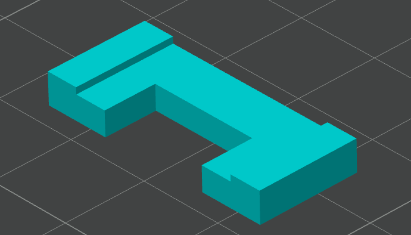
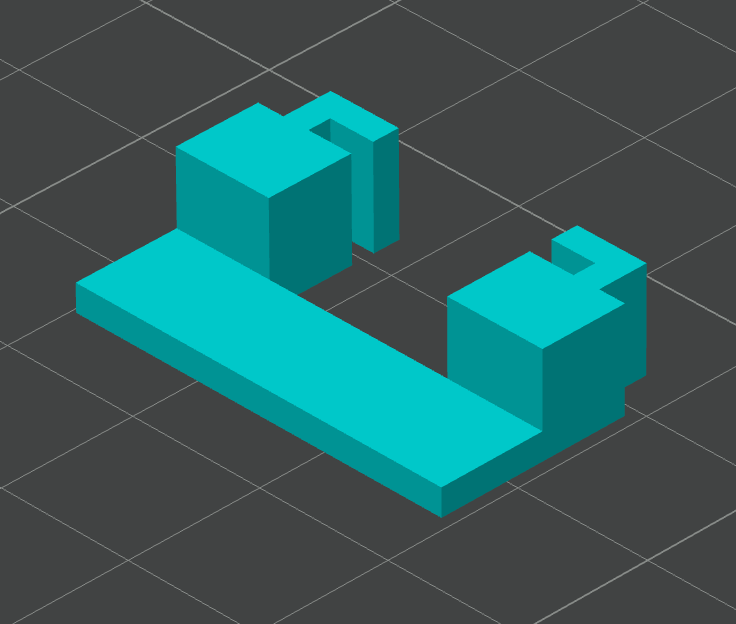
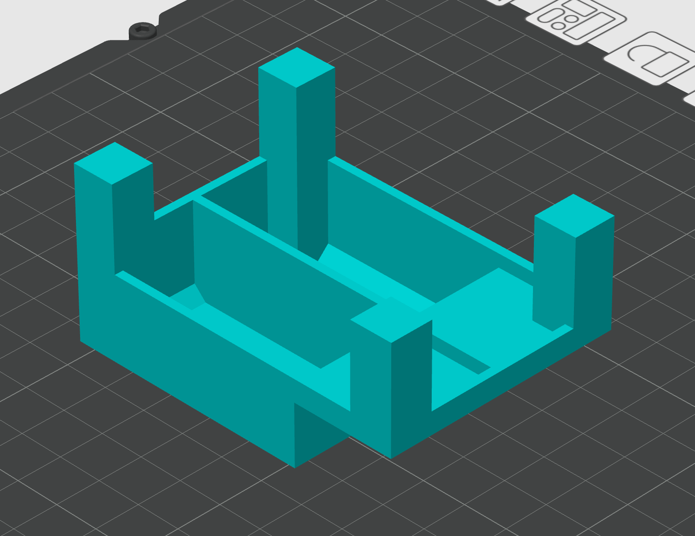

Print the following models in the required quantities.
The parts to be printed are the same for both the Basic and Advanced models.

The STL files are published in [the GitHub repository](https://github.com/pqrs-org/ComboStick/tree/main/models/stl).

| Name                           | Qty | Photo                                                                                 |
| ------------------------------ | --- | ------------------------------------------------------------------------------------- |
| ComboStick-v1-Lower Box        | 1   |                |
| ComboStick-v1-Upper Box        | 1   |                |
| ComboStick-v1-USB A Underneath | 1   |  |
| ComboStick-v1-USB A Holder     | 1   |          |
| ComboStick-v1-USB Hub Base     | 1   |          |
| ComboStick-v1-USB-C Holder     | 1   |          |
| ComboStick-v1-USB-C Top Holder | 1   |  |
| ComboStick-v1-Stick Cover      | 2   |            |
| ComboStick-v1-Wrist-Rest       | 2   |              |

{}

If you need to adjust the STL files, [the FreeCAD file](https://github.com/pqrs-org/ComboStick/tree/main/models) are available.
Modify the FCStd files and then re-export them as STL files.”

{}
