Here are the parts and tools you’ll need for the build.

## Required Parts for the Basic Model

| Name                                         | Qty  | Photo                                                                              |
| -------------------------------------------- | ---- | ---------------------------------------------------------------------------------- |
| Logitech F310                                | 1    | 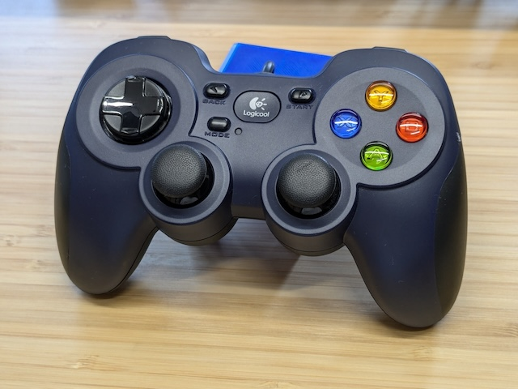             |
| Cherry MX Switches                           | 2    | 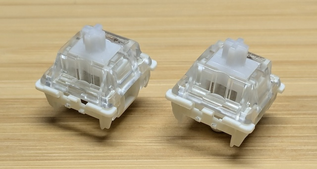    |
| Cherry MX Keycaps                            | 2    | 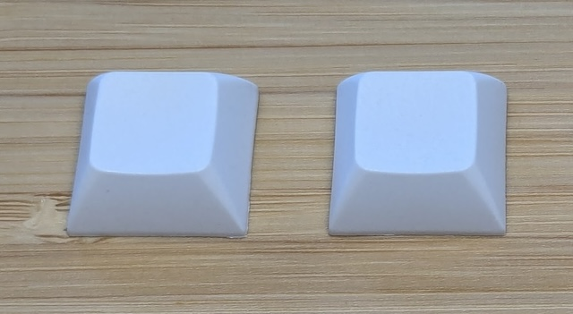      |
| 2-pin Connector with Wires (male and female) | 2set | 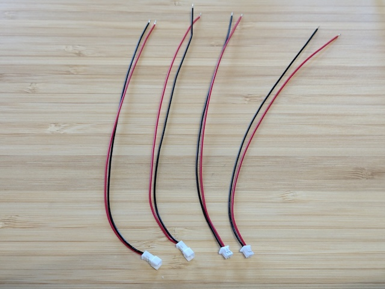                    |
| 10k ohm variable resistors                   | 2    | 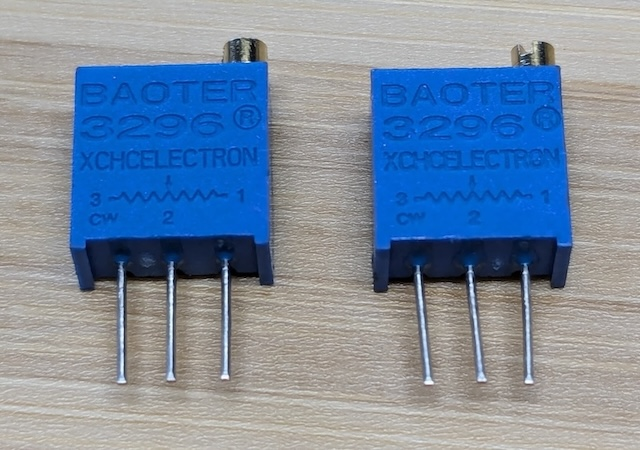            |
| M4 Nuts,Bolts and Washers (M4 10mm)          | 4set | 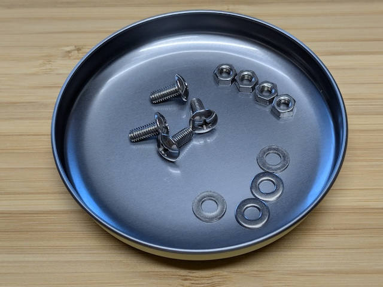 |

## Required Tools for the Basic Model

| Name                          | Required | Photo                                                                                   |
| ----------------------------- | -------- | --------------------------------------------------------------------------------------- |
| 3D Printer                    | Yes      | 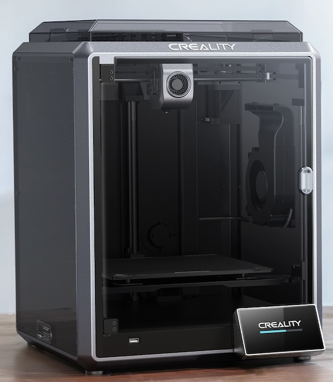               |
| Soldering iron                | Yes      | 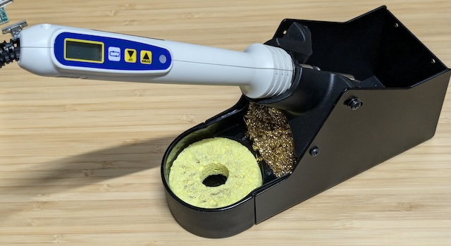       |
| Solder                        | Yes      | 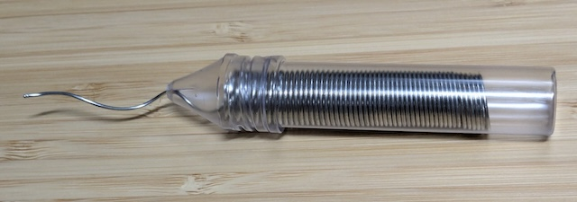                       |
| Desoldering braid (Wick)      | Yes      | 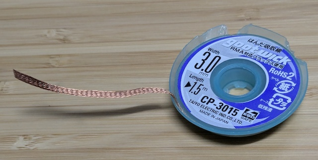 |
| Wire stripper AWG28 and AWG14 | Optional | 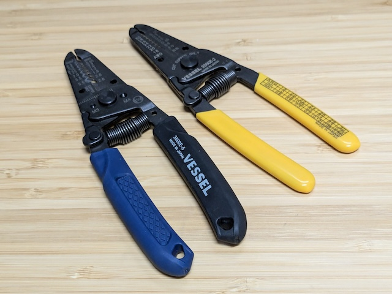         |

{}

These parts are not necessary for building the Basic Model.

| Name                                                           | Qty | Photo                                                                                                                               |
| -------------------------------------------------------------- | --- | ----------------------------------------------------------------------------------------------------------------------------------- |
| USB-C panel mount breakout board (JRC-B008)                    | 2   | 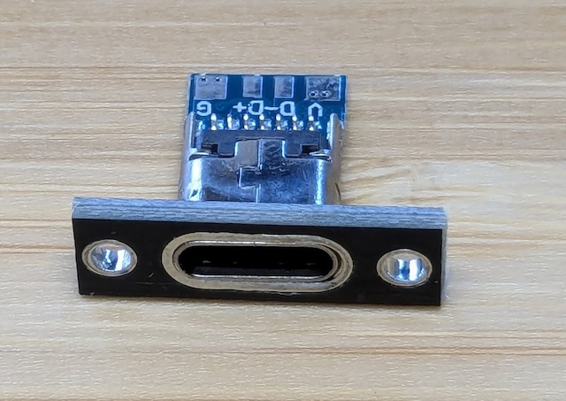 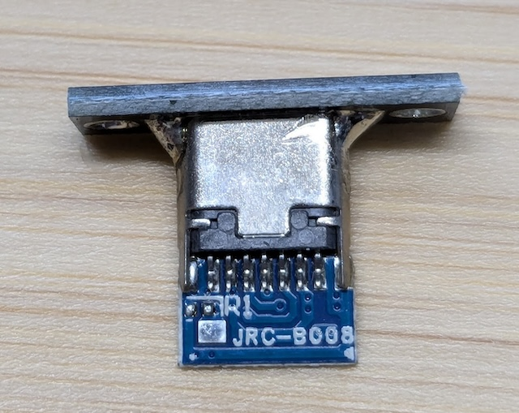 |
| USB 2.0 female head to DIP 4p straight adapter module (HW-766) | 1   | 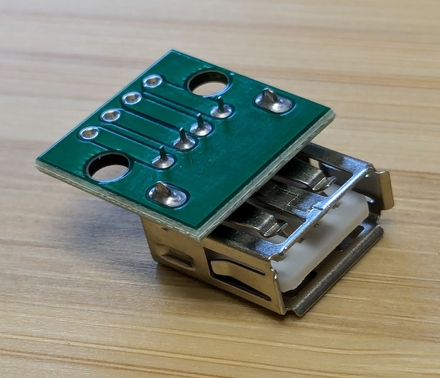 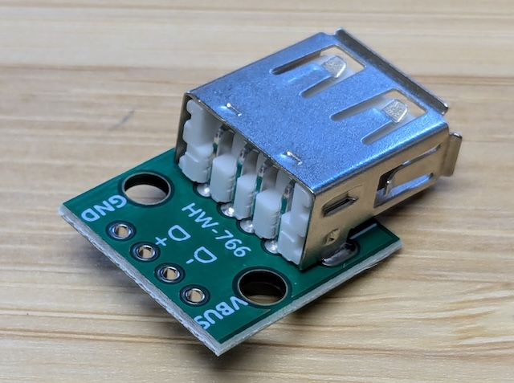 |
| USB 2.0 expansion module HUB hub (FE11SX4)                     | 1   | 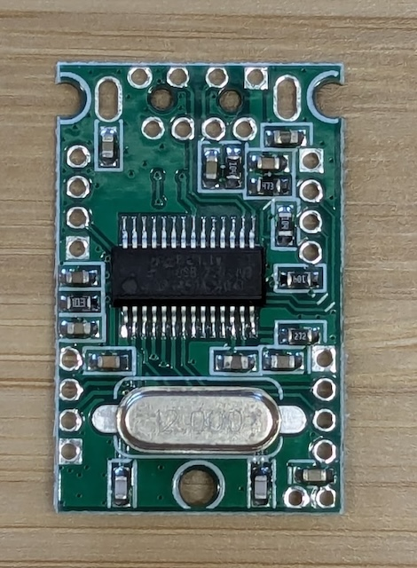 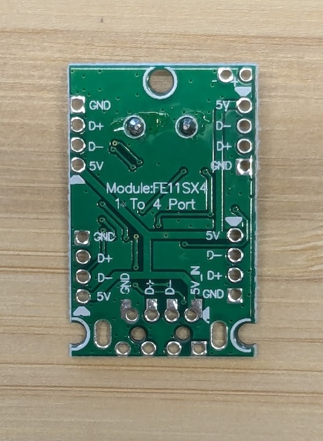 |

{}
