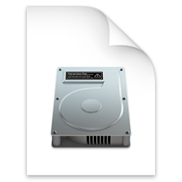

Some operations are required to grant properly permission from macOS to Karabiner-Elements.
Follow this instruction to set up Karabiner-Elements.

## Install Karabiner-Elements

1.  Open the downloaded file.
    
2.  Open a pkg file.
    
3.  The installer will be opened. Install Karabiner-Elements.
    

## Open Karabiner-Elements Preferences

1.  Open Karabiner-Elements from Launchpad.
    

## Allow system software which provides virtual devices for Karabiner-Elements

1.  The following alert will be shown when you open Karabiner-Elements Preferences.
2.  Click **Open Security & Privacy System Preferences** button, then press **Allow** button.
    

{}

Please follow [this instruction](../../help/troubleshooting/kext-allow-button-does-not-work/) if there are any problem about the **Allow** button.

{}

## Grant Input Monitoring to Karabiner-Elements processes

1.  **Two Keystroke Receiving** alerts will be shown on macOS Catalina or later after you allow the kernel extension.
2.  Press **Open System Preferences** button on both alerts.
    
    
3.  System Preferences will be open after you press the Open System Preferences button. 
    Choose **Privacy > Input Monitoring**, and then enable **karabiner_grabber** and **karabiner_observer**.  
    (You have to unlock configuration by the left bottom icon.)
    

## Setup your keyboard layout

1.  Keyboard Setup Assistant will be opened. 
    Choose your keyboard layout. (ANSI, ISO or JIS)
    

## Configure Karabiner-Elements

Enjoy keyboard configuration!

-   [Configuration manual](../../manual/configuration/)
