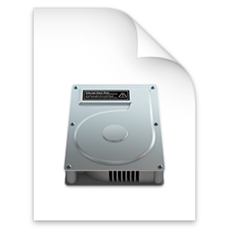

Some operations are required to grant proper permission from macOS to Karabiner-Elements.
Follow these instructions to set up Karabiner-Elements.

## Install Karabiner-Elements

1.  Open the downloaded file.
    
2.  Open the Karabiner-Elements.pkg.
    
3.  The installer will be opened. Install Karabiner-Elements.
    

After installation, you'll need to grant the necessary permissions for Karabiner-Elements to function.
This is part of macOS's protection mechanism to prevent applications from accessing information without user consent.
There are a few required steps, so please follow the instructions.

Additionally, when you open Karabiner-Elements Settings, the necessary actions will be displayed, so you can follow those prompts as well.

## Open Karabiner-Elements Settings

Open Karabiner-Elements from Apps or Finder.



## Grant permissions to Karabiner-Elements in System Settings

When you open Karabiner-Elements Settings, instructions such as allowing Background Services will be displayed.
Follow those instructions and grant the required permissions in System Settings.

Specifically, the following permissions are required:

- Allow privileged and non-privileged background services to run
- Grant Accessibility permission
- Grant Input Monitoring permission
- Allow Driver Extension for the virtual keyboard and mouse

(Normally, Accessibility permission also covers Input Monitoring permission, so it will be granted automatically when you allow Accessibility.)



{}

If the driver extension fails to appear in System Settings or you run into similar issues, check this page:

- [Driver alert keeps showing up](/docs/help/troubleshooting/driver-alert-keeps-showing-up/)

{}

## Choose your keyboard layout

When setup is complete, you will be asked which virtual keyboard layout to use.
Choose the same type as the keyboard you are using.
(You can change this setting later from the Virtual Keyboard tab.)



{}

This setting changes the behavior of some keys (symbol keys) on the keyboard.
If the printed characters on your keyboard do not match what is input, please change this in the Virtual Keyboard settings.

{}

## Configure Karabiner-Elements

Enjoy keyboard configuration!

- [Configuration manual](../../manual/configuration/)
