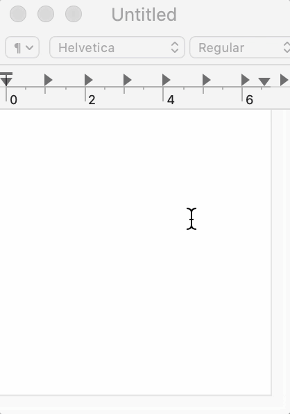
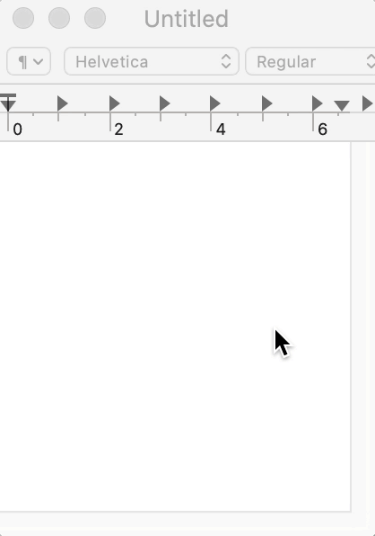
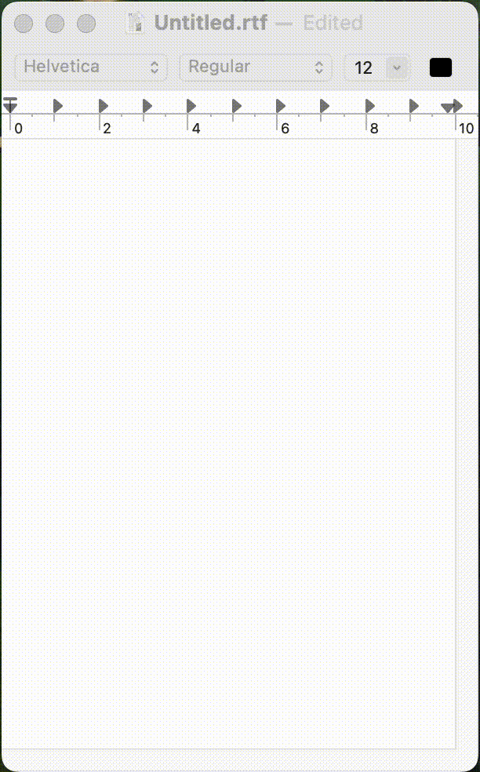

You can change the effect.

1.  [Open Settings](../open-settings/).
2.  Choose the effect.
    

## Effects

    

        Neon (blue) 
        
    

    

        Shock wave (blue) 
        
    

    

        Line (blue) 
        
    

